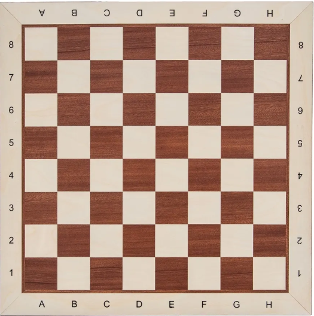
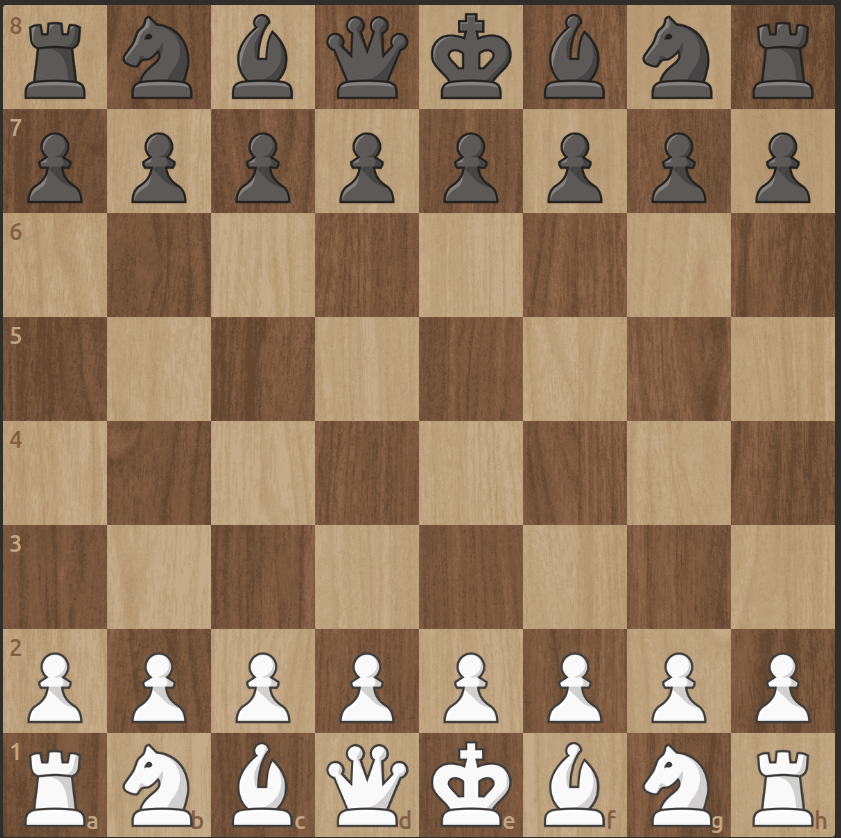

# Bot_Stockfish

Stockfish est le bot ultime en terme de jeux d'echecs. Il est opensource donc quoi de mieux que de l'entraîner sur mes propres donnés pour apprendre avec lui les bons coups.

## Configuration minimale

### Python 

- Créer un environnement virtuel pour ne pas avoir de problème de dépendances

```bash
python3 -m venv jr_bot
```
- Activer l'environnement virtuel que vous venez de créer :

```bash
source ./Fine_Tuning_Stockfish/jr_bot/bin/activate
```

- Installez les librairies nécessaires pour le bon fonctionnement des fichiers python

```bash
cd Fine_Tuning_Stockfish
pip install -r requirements.txt
```

### Stockfish

- Disponible en téléchargement via les dépots `apt` avec les commandes :

```bash
sudo apt-get update

sudo apt-get install stockfish
```

- Verification de l'installation :

```bash
which stockfish
```

## Petit historique : Les Echecs

Je ne suis que joueur ammateur donc je vais expliquer ce que j'ai compris en général.

Les echecs c'est un jeu de plateau de 8 cases par 8 cases dont :

- en colonnes on trouve des lettres allant de `a` à `h`

- en lignes ce sont les chiffres allant de `1` à `8`




Le but du jeu est de `mater` le roi adverse. Un roi est dit échec et mat lorsqu’il est en échec et qu’aucun coup légal, ni du roi ni d’une autre pièce, ne permet de lever cet échec.

Cette situation est souvent confondue avec le `pat`, où le roi n’est ni en échec ni mat, mais où le joueur n’a aucun coup légal à jouer alors que c’est à lui de jouer ; la partie est alors déclarée **nulle**.

### Les notations chesscom

Les notations du jeu sont en anglais et ça porte confusion si on ne sait pas.

- K : King (le roi)

- Q : Queen (la reine)

- R : Rook (la tour)

- N : Knight (le cavalier)

- B : Bishop (le fou)

Les pions sont directement représentés selon la ligne et la colonne où ils se trouvent.

### La position de départ

Vous avez :

- 8 pions : seconde rangée (pour les blancs) et septième rangée (pour les noirs)

- 1 Roi : placé en e1 (pour les blancs) et e8 (pour les noirs)

- 1 Reine : placé en d1 (pour les blancs) et d8 (pour les noirs)

- 2 Tours : en a1 et h1 (pour les blancs) et a8 et h8 (pour les noirs)

- 2 cavaliers : en b1 et g1 (pour les blancs) et b8 et g8 (pour les noirs)

- 2 fous : en c1 et f1 (pour les blancs) et c8 et f8 (pour les noirs)




## Structure du répo

### data_pgn

Contient les **5675** parties que j'ai eu à jouer sur mon compte personnel sur la plateforme `chess.com`.

Le fichier est enregistré sous un format `.pgn` (**P**ortable **G**ame **N**otation) dont la structure est comme ceci :

```pgn
[Event "Live Chess"]  <-- partie en temps réel
[Site "Chess.com"]    <-- site du jeu
[Date "2025.07.22"]   <-- date à laquelle la partie a été jouée
[Round "-"]   <-- pas de valeur parce que c'était pas en tournoi
[White "user_name"]  <-- utilisateur avec les pièces blanches
[Black "user_name"]  <-- utilisateur avec les pièces noires
[Result "0-1"]   <-- résultats de la partie
[WhiteElo "1850"]  <-- le classement elo du joueur aux blancs
[BlackElo "1844"]  <-- le classement elo du joueur aux noirs
[TimeControl "180"]   <-- la cadence de la partie (180 secondes ici)
[EndTime "17:22:21 GMT+0000"]  <-- l'heure à laquelle la partie s'est terminée
[Termination "user_name won by checkmate"]   <-- Comment la partie s'est terminée

1. d4 e6 2. Nf3 d5 3. Bf4 Nf6 4. e3 c5 5. Be2 Nc6 6. dxc5 Bxc5 7. c3 Qb6 8. Qc2
Bd7 9. Be5 Nxe5 10. Nxe5 Bd6 11. Nxd7 Nxd7 12. O-O O-O 13. Nd2 Rac8 14. Nf3 h6
15. h3 Ne5 16. Rfd1 Nxf3+ 17. Bxf3 a6 18. Rd4 Be5 19. Rb4 Qc7 20. Qb3 b5 21. a4
Bd6 22. Rd4 Rb8 23. axb5 Rxb5 24. Qa4 Rxb2 25. Qxa6 Rfb8 26. Rb4 Bxb4 27. cxb4
R2xb4 28. Rf1 Rb1 29. Be2 Rxf1+ 30. Bxf1 Rc8 31. h4 Qc1 32. g3 Rc2 33. Qa8+ Kh7
34. Qf8 Qe1 35. Qxf7 Rc1 36. Kg2 Qxf1+ 37. Kf3 Qh1+ 38. Kf4 Qe4# 0-1
```

Explication des notations (pas en entier vu que ça prendrait trop de lignes) :

- 1. d4 e6 : le 1 représente le premier coup (comment la partie a debuté). d4 représente la ligne **4** et la colonne **d** (coup joué par les blancs). e6 représente la ligne **6** et la colonne **e** (coup répondu par les noirs).

- Les symbôles :

    - \+ : c'est pour dire que le roi est en echec (le roi est menacé sur sa position)

    - x : ça veut dire capture (par exemple `Qxf7` : Queen captures a pawn on line 7 and column f).

    - O-O : veut dire petit roque (le roi part se cacher), l'action se fait avec la tour (noté R).

    - \# : c'est le signe de l'echec et mat (le roi est en echec mais n'a plus de case de fuite alors que c'est à son tour de jouer).

    

